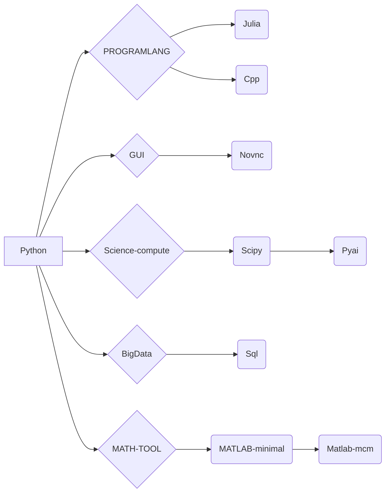

# jupyter-image-stacks

## Jupyterlab Image stacks for Data Science

**ghcr.io: https://github.com/eoeair/jupyter/pkgs/container/jupyter**

### HOW TO USE
**Docker**
* No data is used persistently：`docker run -d -p 8888:8888 ghcr.io/eoeair/jupyter:<tag>`  
* Provide data for persistent use：`docker run -d -p 8888:8888 -v "${PWD}":/home/jovyan ghcr.io/eoeair/jupyter:<tag>`

**Jupyterhub on K8S**  
Specify the image in the profile of the singleuser
```
- description:  SCIPython, for scientific research and engineering applications.
    display_name: Scipy
    kubespawner_override:
        image: ghcr.io/eoeair/jupyter:scipy
```

**Jupyterhub on Docker**
```
c.DockerSpawner.allowed_images = {
        'Scipy': 'ghcr.io/eoeair/jupyter:scipy'
}
```
### Global description
1. If you build or fork the image yourself, replace the base image in the Dockerfile with the image on DockerHub
2. For commercial software such as Mathematica, MATLAB, etc., we only provide packaging, and the specific activation method and possible consequences are borne by the user
3. The following code fixes the issue of missing Chinese characters in matplotlib plots.(You need to install `wqy-zenhei` beforehand.)
```
from matplotlib.font_manager import FontProperties
# Set the path to the Chinese font
zh_font = FontProperties(fname="/usr/share/fonts/truetype/wqy/wqy-zenhei.ttc")
# Set the Chinese font as the default font in matplotlib
plt.rcParams["font.family"] = zh_font.get_name()
```
### List of images that are currently being built
* Base: benchmarking against the jupyter official minimal-notebook image
    * Description
        1. Upstream has switched to `debian:bookworm-slim`
        2. Sudo is added for passwordless use. In scenarios with high security requirements, do not allow privilege escalation
        3. Provided packages: .zip extraction
* Python: Supports Python
    * Scipy: Provides a scientific computing environment for Python
    * pyai (With GPU): Provides Flax
* Julia: Supports Julia
    * Description:
        1. Environment variable `JULIA_NUM_THREADS` in Julia image, please configure according to desired concurrency threads at startup, default is 8
* MATLAB: A programming and numerical computing platform that supports data analysis, algorithm development, and modeling.
    * Description
        1. Upload `license.lic libmwlmgrimpl.so` to the main directory. Each time the environment is started, run `sudo cp license.lic /opt/matlab/r2023b/licenses/ && sudo cp libmwlmgrimpl.so /opt/matlab/r2023b/bin/glnxa64/matlab_startup_plugins/lmgrimpl/` to activate before use.
        2. If you have an account, use web verification/online verification.
    * minimal: Contains only `Product:MATLAB`
    * mcm: Contains toolboxes required for mathematical modeling.


### List of plugins

**Global**
* jupyterlab-language-pack-zh-CN:Support for Chinese
* jupyterlab-lsp：It is used for autocompletion, parameter suggestion, function document query, and jump definition
* jupyterlab-execute-time: Displays the execution time of each cell
* jedi-language-server: Python Language server

**Part**

* Julia: julia-language-server: Julia Language server

### Image dependencies


## Upstream

**Package version**
* cuda 12.4.0
* Python 3.11
* Julia latest
* jupyterlab 4
* Matlab R2023b

**Default Mirror source**
* pip bfsu：https://mirrors.bfsu.edu.cn/help/pypi/
* apt ustc：https://mirrors.ustc.edu.cn/help/debian.html
* julia-pkg mirrorz: https://mirrors.cernet.edu.cn/julia

***Now You can use ARG control which site you want***

### Upstream of the project
https://github.com/jupyter/docker-stacks

**However, we are quite different from the upstream in terms of sources, packages, localizations, extensions, etc., so if you have a problem with this project, please do not ask the Jupyter team questions, as it will increase their workload**

### kernel
* Python：https://ipython.org/
* Julia: https://github.com/JuliaLang/IJulia.jl
* MATLAB: https://github.com/mathworks/jupyter-matlab-proxy

## Necessary copyright notice
For code derived from other teams, we added the original copyright notice to the file header, and we retain and support the copyrights of other development teams